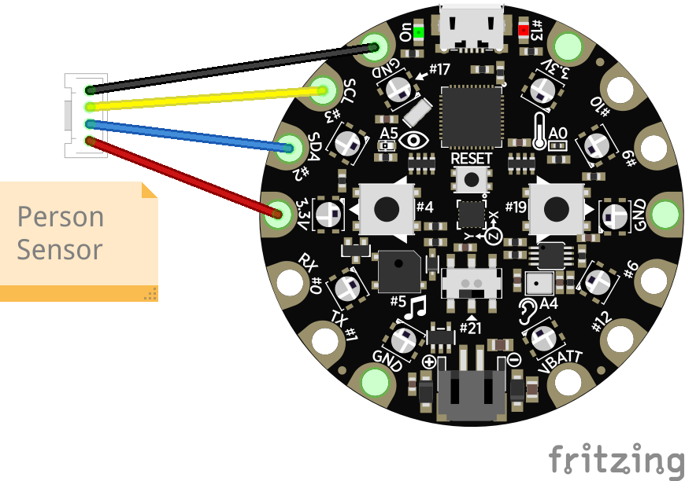
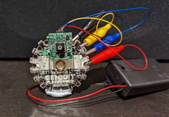
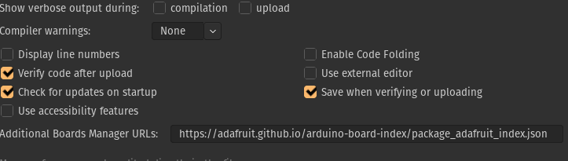
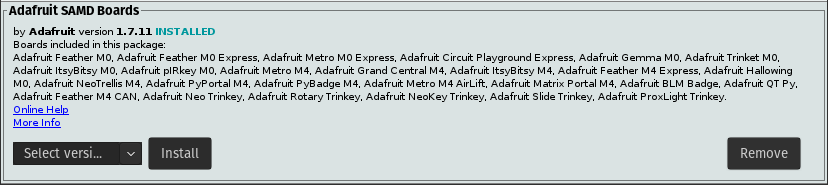

# Person Sensor TV Remote
Arduino project for Circuit Playground Express that automatically pauses your TV
when you get up from the couch.

The [Person Sensor](https://usfl.ink/ps) from [Useful Sensors](https://usefulsensors.com)
is a small, low-cost hardware module that detects nearby peoples’ faces, and
returns information about how many there are, where they are relative to the
device, and performs facial recognition. It is designed to be used as an input
to a larger system, and this example shows how to use it to control a TV so that
it pauses what you're watching when you leave the viewing area, and resumes when
you return.

## BoM

To build this project you'll need:

 - [Circuit Playground Express](https://www.adafruit.com/product/3333).
 - [Person Sensor from Useful Sensors](https://usfl.ink/ps).
 - [Qwiic connector cable with alligator clips](https://www.adafruit.com/product/4398).
 - Blu Tack or something similar to hold the sensor in place.

No soldering is required. You need to make sure you get the "Express" version of
the Circuit Playground board, because this is the only one with a built-in IR
transmitter and receiver. You can probably adapt this to other boards with
external IR modules, but you'll need to figure out how to interface them with
CircuitPython. At the time of writing, the Circuit Playground Express board was
out of stock at Adafruit, but the slightly more expensive [base kit](https://www.adafruit.com/product/3517)
that includes one was in stock.

## Assembling

Wiring up the sensor requires a cable with a Qwiic/Stemma QT connector on one
end, and four alligator clips on the other. These clips connect VDD, GND, SDA
and SCL from the sensor to the board. First plug in the connector to the sensor.
This should only connect one way round, with the exposed metal facing the board.
The alligator clips then connect to four tabs on the Circuit Playground. If the
side with the buttons and components on is facing you, you start at the 11 
o'clock position with GND (black), the anti clockwise with SDC (yellow), then
SDA (blue), and finally 3.3V (red). Here's a wiring diagram:

Once the Circuit Playground is plugged into USB, you should see the green light
on the person sensor glow when a face is visible.

### Mounting

The Person Sensor needs to be mounted on the back of the board, on the opposite
side to the buttons. This will be looking back at you on the couch, while the IR
transmitter on the other side sends commands to the TV to play or pause
depending on whether you're around. I bought [an enclosure](https://www.adafruit.com/product/3915)
and used Blu Tack to mount the sensor in the right position, but I'm sure those
of you more skilled can come up with a more elegant solution.

## Arduino Setup

We're going to be using the Arduino IDE to build and flash our program. Download
the version for your OS to start. There's [an official Adafruit guide](https://learn.adafruit.com/adafruit-circuit-playground-express/set-up-arduino-ide)
to installing what you need for a Circuit Playground Express, but **don't follow
it**! It uses the more limited Arduino version of the board package, which
doesn't support a lot of the CPX's features. Instead, you'll need to install the
Adafruit version of the board package.

To do this, you'll need to first add `https://adafruit.github.io/arduino-board-index/package_adafruit_index.json`
to the `Additional Boards Manager URLs` field in the Arduino preferences window.

Once this is set, go to `Tools->Board->Boards Manager...` in the Arduino IDE and
search for "Adafruit SAMD". You should see a package called "Adafruit SAMD
boards" which includes the Circuit Playground Express in its description.

Make sure that you install the **Adafruit** version, not the default **Arduino**
package, since only the Adafruit board library has full support for all of the
CPX's peripherals.

Next, we'll need to install a library to store information about any recorded IR
codes even when the board is powered down. Go to `Tools->Manage Libraries` and
add `FlashStorage` to your Arduino libraries.

## Running the Code

If you're familiar with `git` you can download the code in this repository from
[github.com/usefulsensors/person_sensor_tv_remote](https://github.com/usefulsensors/person_sensor_tv_remote)
but don't worry if not, you can get it [all as a ZIP](https://github.com/usefulsensors/person_sensor_tv_remote/archive/refs/heads/main.zip)
file too. Once you have the code on your local machine, open the
`person_sensor_tv_remote.ino` file in the Arduino IDE. Make sure that your
Circuit Playground Express board is connected by USB to your computer, and that
you've selected the right port from the `Tools->Port` menu, and that you have
selected "Adafruit Circuit Playground Express" as the board. Once that's all set
up, press the upload button (an arrow pointing right in the top left of the IDE)
to compile and flash the program.

## Setting Up the Board

The system is designed to send the same IR code as the play button when it spots
a person nearby, and the pause IR code when nobody seems to be around. Because
different TVs use different codes, you'll probably need to tell the device what
the codes are for your model. The sketch defaults to codes that work with most
Samsung TVs when it's first flashed onto the board, but you can record new ones
from your own remote.

### Testing the Board

Before you try it out on your TV, it's a good idea to make sure the basic
functionality is working. You can do this by pointing the person sensor at your
face, and making sure the green light on the board comes on. Then point the
sensor away from you or cover the lens, watch the green light go off, and wait a
few seconds. You should hear the speaker on the board say "Pause", though it is
quite quiet and can be hard to understand. If you then point the sensor back at
your face for a second or so, you should hear "Play". This shows the device is
correctly pausing when nobody is around, and playing when they return.

### Recording your Remote

If you're not using a Samsung TV, you'll need to record the correct IR codes for
your brand from your existing remote. These days a lot of higher end models are
moving towards Bluetooth connections, which I'll cover in a future project, but
most at least still understand IR codes. If you find you can't record, it's
possible to update the sketch to default to the right codes, if you can find
information about them online. Searching can be confusing though, since the
codes aren't the same as the ones used to program universal remotes.

If you have an IR remote, you can get started by pressing the left button on the
board. You should "Recording, press play", and see the board's LEDs light up in
a counter-clockwise pattern. Point your remote at the front of the board and
press the play button. Once the board recognizes it, the speaker will say "Press
pause", and the LEDs will rotate clockwise. When that code has been recognized,
the board will say "Done". These values will be saved in flash, so if you power
down and restart the board, they will be remembered. They are reset to the
default values if you flash the sketch again though.

## Auto-pausing your TV

Now that you've got everything set up, you can sit back, relax, and let the
board take care of controlling your TV! The person sensor has a useful range of
about two meters, or six feet, so make sure that the sensor is facing you on
somewhere like a coffee table, with the front of the board (which has the IR
transmitter and receiver) pointing at the screen. You should see the green LED
on the sensor light up when it sees you, and if no face is seen for five seconds
it will send the pause IR code. Then, when a face is seen continuously for at
least a second, the play code will be sent. The idea is that it should pause
when you get up off the couch, and play again once you've settled back down.

This is definitely still a prototype though, both the sensor and this sketch are
very much works in progress, so you may well want to tweak the code to make it
a better fit for you. If you look in the sketch, you can change constants like
`pauseDelaySeconds` and `playDelaySeconds` to adjust the timing, or get more
advanced by altering the logic around what it takes to trigger playing and
pausing.